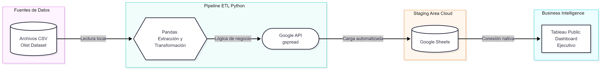
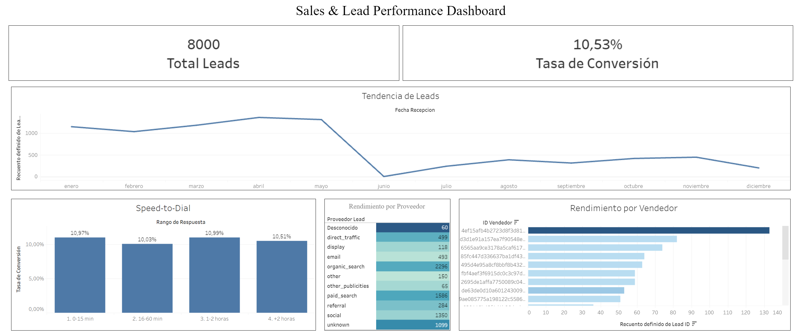

# 📊 Sales & Lead Performance Analytics | End-to-End ETL & BI Dashboard


## Visión General
Este proyecto demuestra el desarrollo de un **pipeline de datos (ETL)** completamente automatizado y un **Dashboard Ejecutivo** interactivo para resolver un caso de negocio real: optimizar el embudo de ventas y analizar el impacto del tiempo de respuesta (*Speed-to-Dial*) en las tasas de conversión.

A diferencia de proyectos teóricos, esta arquitectura simula un entorno de producción B2B moderno, extrayendo datos crudos, transformándolos mediante reglas de negocio en Python, y cargándolos en un almacén en la nube para su consumo en Tableau.

---

## 🏗️ Arquitectura de Datos

> **Sugerencia visual:** *Sube una imagen simple o diagrama que muestre 3 bloques: [Python/Pandas] -> [Google Sheets] -> [Tableau]. Guarda la imagen en tu repositorio y reemplaza el enlace de abajo.*



1. **Extracción:** Consumo de datasets relacionados con marketing y ventas (basado en el *Olist Marketing Funnel* de Kaggle).
2. **Transformación:** Limpieza de datos (Pandas), cruce de tablas relacionales (Leads vs. Deals) y generación de métricas de negocio simuladas (`Minutos_Respuesta`, `Costo_Lead`).
3. **Carga:** Conexión segura vía Service Account a la API de Google Drive/Sheets para servir como base de datos en la nube (Staging Area).
4. **Visualización:** Conexión nativa desde Tableau Public para el modelado visual y análisis.

---

## 📈 Impacto de Negocio & Dashboard

El dashboard resultante permite a la gerencia de ventas responder preguntas críticas en segundos:

* **Speed-to-Dial:** ¿Cuánto cae la tasa de conversión si los vendedores tardan más de 1 hora en contactar a un lead?
* **Lead Vendor Performance:** ¿Qué canal de marketing (Organic, Paid, Email) genera el mayor volumen de leads y la mejor rentabilidad?
* **Top Performers:** ¿Qué representantes de ventas están cerrando la mayor cantidad de tratos de alto valor?
* **Tendencia:** Análisis de la entrada mensual de leads para la planificación de capacidad operativa.

🔗 **[Ver Dashboard Interactivo en Tableau Public](https://public.tableau.com/app/profile/fabian.cristobal/viz/Sales-Lead-Performance-Dashboard/SalesLeadPerformanceDashboar?publish=yes)**

> **Sugerencia visual:** *Toma una captura de pantalla completa de tu dashboard final en Tableau y súbela aquí.*



---

## ⚙️ Estructura del ETL (Python)

El proyecto sigue buenas prácticas de ingeniería de software, modularizando el código para facilitar su mantenimiento.

| Archivo / Carpeta | Descripción técnica |
| :--- | :--- |
| `data/` | Directorio local (ignorado en `.gitignore` por seguridad) para los archivos `.csv` crudos. |
| `etl/extraction.py` | Lee y carga los datos relacionales en DataFrames de Pandas. |
| `etl/transform.py` | Cruza bases de datos, limpia valores nulos y aplica lógica de negocio para generar el dataset analítico final. |
| `etl/loading.py` | Autenticación mediante credenciales `.json` y uso de `gspread` para sobreescribir la base de datos en la nube. |
| `main.py` | Script orquestador que ejecuta el pipeline secuencialmente y maneja los logs de consola. |
| `.env` / `.gitignore` | Gestión de variables de entorno y protección de las claves de la API de Google Cloud. |

---

## 🚀 Cómo ejecutar el proyecto localmente

1. Clona este repositorio:
   ```bash
   git clone [https://github.com/tu_usuario/nombre_del_repositorio.git](https://github.com/tu_usuario/nombre_del_repositorio.git)
   ```
2. Crea y activa tu entorno virtual
   ```bash
    python -m venv venv
    source venv/Scripts/activate  # En Bash
   ```
4. Instala las dependencias:
   
6. Configura tus credenciales:
  * Los datos 
8. Ejecuta el orquestador:
   ```bash
    python main.py
   ```

## Autor
**Fabian Cristobal**
Data Analyst & Data Engineer
Si te interesa discutir cómo este enfoque puede aplicarse a los datos de tu empresa, no dudes en conectar.
